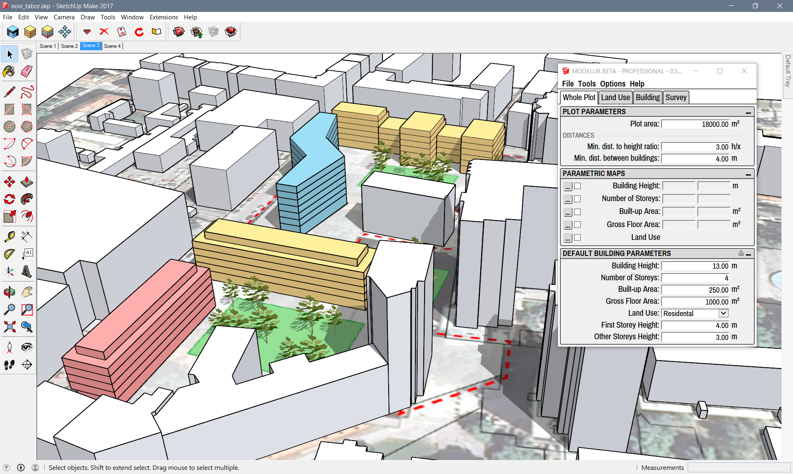

<!--
We can not align to center using regular markdown...
But we do it using custom.css

-->

Welcome to Modelur!
===================

[Modelur](https://modelur.eu) is a parametric urban design tool that helps architects, urban designers and planners quickly develop urban design projects. Its primary purpose is to help designers quickly create urban design proposals and take well-informed decisions during the early stages of the process, while design is still evolving. This is possible due to its real-time survey, which calculates urban control indicators, such as Floor Space Index, Built-up Area or Required number of Parking Lots on-the-fly.

Modelur is implemented as a plug-in for [Trimble SketchUp](http://www.sketchup.com).

Although we strive to make Modelur as intuitive as possible, we can not escape the need for good user documentation. And here it is! As this documentation is a part of our Beta release of Modelur, it is subject to changes in the future. If you find some mistake or you miss some explanation, please drop us an [e-mail](mailto:support@modelur.com).

Using this guide
----------------

This guide can be used in several ways. You can use it as a [quick start guide](quickstart), to get you up-and-running with Modelur fast. If you want to get help and more details about some functionality of Modelur, [Detailed Workflow](detailed-workflow) section is for you. It explains every detail of how Modelur works and how urban control values are calculated. In between, there are Menu and Tabs sections, which provide more detail on Modelur user interface.