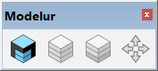
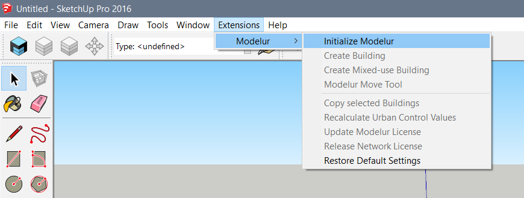

UI overview
===========

In this section we will quickly introduce you to the structure of Modelur's User Interface. Getting to know its logic will help you easily integrate it into your regular workflow.

Once Modelur is installed you have two options to initialize it. First option is to click on the blue icon in Modelur Toolbar. This toolbar shows up once Modelur you install Modelur (Figure 1). 

<figcaption>Figure 1 - Modelur Toolbar. If toolbar is not visible, you can open it via SketchUp menu <i>View > Toolbars > Modelur</i>. To initialize it, click on the blue Modelur icon. This toolbar can be stacked next to other toolbars in SketchUp.</figcaption>

Second option to initialize Modelur is to navigate to it through SketchUp menu _Plugins > Modelur > Initialize Modelur_ (Figure 2).

<figcaption>Figure 2 - Alternative way to initialize Modelur through SketchUp menu <code>Plugins > Modelur > Initialize Modelur</code>. Please note that Plugins menu was called Extensions in previous versions of SketchUp.</figcaption>